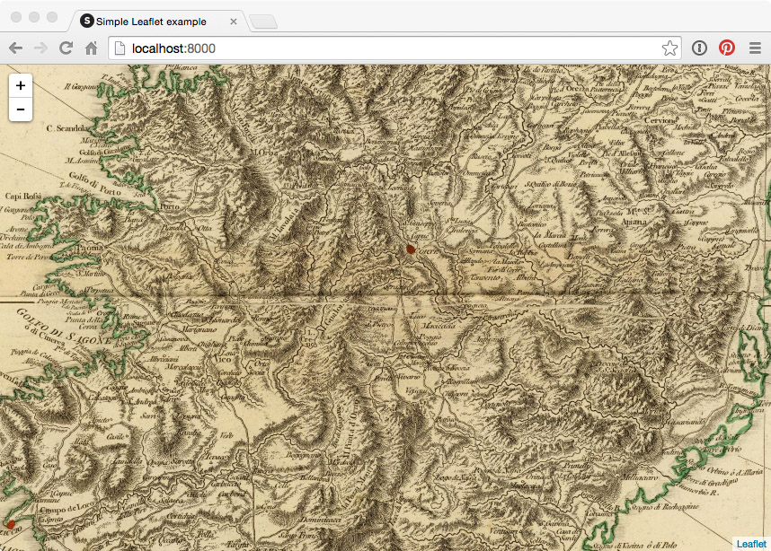

#gdal2tiles-example

Example showing how to create map tiles from an image using [GDAL](http://www.gdal.org/)'s [gdal2tiles](http://www.gdal.org/gdal2tiles.html). Made for second edition of [Maptime Amsterdam](maptime-ams.github.io). This example uses a [map of Corsica](http://www.davidrumsey.com/luna/servlet/detail/RUMSEY~8~1~31541~1150020:Corsica-?sort=Pub_List_No_InitialSort%2CPub_Date%2CPub_List_No%2CSeries_No&qvq=q:corsica;sort:Pub_List_No_InitialSort%2CPub_Date%2CPub_List_No%2CSeries_No;lc:RUMSEY~8~1&mi=78&trs=221#) from the [David Rumsey Map Collection](http://www.davidrumsey.com/)

Prerequisites:

- Install Python2.7
- Install GDAL-core
- Install GDAL-Python bindings

To create map tiles from any given image, run `gdal2tiles.py` in your console:
```bash
gdal2tiles.py -p raster -w none corsica.jpg
```

The created tiles can be used in Leaflet by using Leaflet's `tms` option:

```javascript
L.tileLayer(tileUrl, {tms: true}).addTo(map);
```


